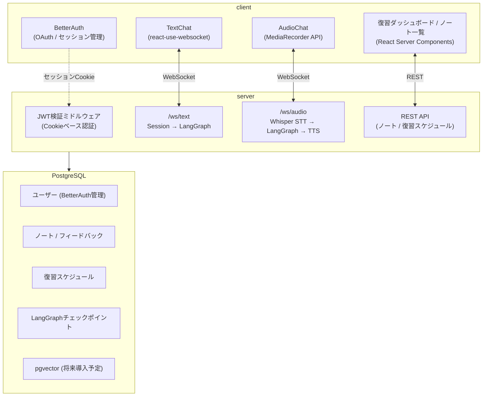

# Learning Optimizer

## 概要

インプットした知識を「自分の言葉で説明する（アウトプットする）」機会の不足によって、記憶が揮発してしまう課題を解決するための学習定着アプリケーションです。

「プロテジェ効果（人に教えることで学ぶ）」をLLMとの対話によってシステム化しています。ユーザーが学習内容を入力すると、LLMが的確な深掘り質問を投げかけます。それに「自分の頭で思い出して答える」だけで、バラバラだった知識が意味のある塊として整理され、最小のインプットで最大の長期記憶定着（アウトカム）を実現します。

### 主な特徴 (Key Features)

- **学習のインプット (テキスト/音声)**: 日々の学習トピックを直感的にシステムへ入力。
- **LLMとの深掘り対話**: LLMエージェントからの質問に答えることで、記憶の引き出しを強力にサポート。
- **ノート＆フィードバック自動生成**: 対話セッション終了時に、要約と重要な概念を自動でノート化して保存。
- **忘却曲線に基づく復習**: エビングハウスの忘却曲線を利用し、記憶の定着に最適なタイミングで復習をスケジュール。

## アーキテクチャと技術スタック



### フロントエンド

| カテゴリ       | 技術                        | 用途                                    |
| -------------- | --------------------------- | --------------------------------------- |
| フレームワーク | Next.js (App Router)        | SSR/RSC対応のフルスタックフレームワーク |
| 言語           | TypeScript                  | 型安全なフロントエンド開発              |
| 認証           | BetterAuth                  | OAuth / セッション管理                  |
| WebSocket      | react-use-websocket         | サーバーとの双方向リアルタイム通信      |
| Markdown       | react-markdown              | LLM応答のレンダリング                   |
| 音声入力       | MediaRecorder API (Web標準) | ブラウザでの音声録音                    |

### バックエンド

| カテゴリ                | 技術                     | 用途                                |
| ----------------------- | ------------------------ | ----------------------------------- |
| 言語                    | Python 3.13              | -                                   |
| Webフレームワーク       | FastAPI + Uvicorn        | WebSocket / RESTエンドポイント      |
| LLMオーケストレーション | LangGraph + LangChain    | 学習フローの状態管理・ルーティング  |
| LLM                     | OpenAI `gpt-4.1-nano`    | 対話・ノート生成・フィードバック    |
| STT                     | OpenAI `whisper-1`       | 音声→テキスト変換                   |
| TTS                     | OpenAI `gpt-4o-mini-tts` | テキスト→音声変換                   |
| 認証検証                | PyJWT                    | BetterAuthセッションCookieのJWT検証 |
| パッケージ管理          | uv                       | 依存関係管理                        |

### データベース

| カテゴリ         | 技術                          | 用途                        |
| ---------------- | ----------------------------- | --------------------------- |
| RDBMS            | PostgreSQL                    | 全データの永続化            |
| ベクトル検索     | pgvector (将来導入予定)       | ノートのセマンティック検索  |
| チェックポイント | langgraph-checkpoint-postgres | LangGraphフロー状態の永続化 |
| データアクセス   | asyncpg + 生SQL               | SQLファーストアプローチ     |
| マイグレーション | 未定 (dbmate等を検討中)       | スキーマバージョン管理      |

### LangGraph フロー

```
START → router ─┬─► learning_start ──────────────────► END
                ├─► learning_dialogue ─┬─► END
                │                      └─► generate_note → generate_feedback → END
                └─► generate_note → generate_feedback → END
```

- **router**: `phase` の値に基づき次のノードへ条件分岐
- **learning_start**: トピック受け取り → 深掘りLLMが最初の質問を生成
- **learning_dialogue**: 深掘り対話を継続。ユーザーが「終了」と発話すると `LEARNING_END` を返しノート生成へ遷移
- **generate_note**: 対話履歴全体から Structured Output でノートを自動生成
- **generate_feedback**: ノートを専門家LLMが評価し、理解度（high/medium/low）・良かった点・改善点を返却

> 技術選定の詳細な背景・比較検討・トレードオフについては [docs/adr/](docs/adr/) を参照。

## 前提条件とセットアップ手順

## ディレクトリ構造
