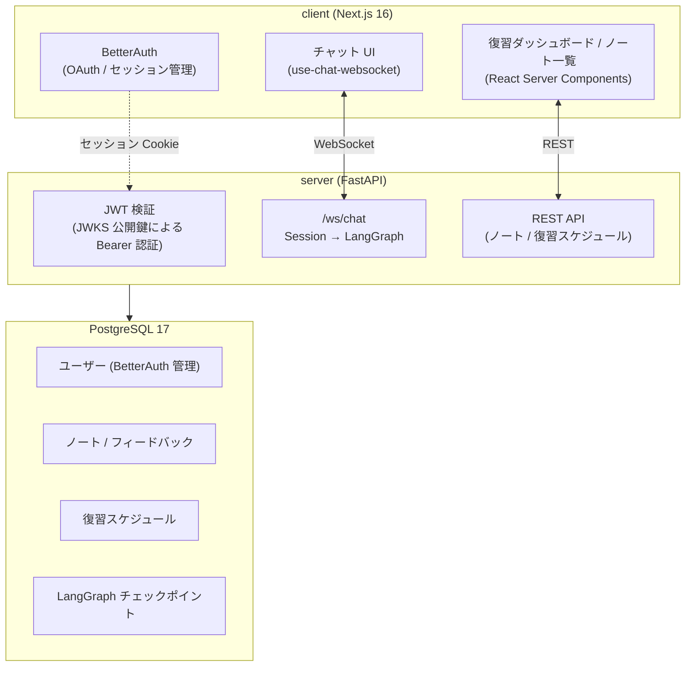

# Learning Optimizer

> 「人に教えることで学ぶ（プロテジェ効果）」を LLM との対話でシステム化した、長期記憶定着のための学習アプリケーション。

[](https://github.com/R-koma/learning-optimizer/actions/workflows/ci.yml)


---

## 目次

- [概要](#概要)
- [主な特徴](#主な特徴)
- [アーキテクチャ](#アーキテクチャ)
- [技術スタック](#技術スタック)
- [LangGraph フロー](#langgraph-フロー)
- [セットアップ](#セットアップ)
- [開発](#開発)
- [テスト](#テスト)
- [ディレクトリ構造](#ディレクトリ構造)
- [ドキュメント](#ドキュメント)

---

## 概要

インプットした知識を「自分の言葉で説明する（アウトプットする）」機会の不足によって、記憶が揮発してしまう課題を解決するための学習定着アプリケーションです。

「プロテジェ効果（人に教えることで学ぶ）」を LLM との対話によってシステム化しています。ユーザーが学習内容を入力すると、LLM が的確な深掘り質問を投げかけます。それに「自分の頭で思い出して答える」だけで、バラバラだった知識が意味のある塊として整理され、最小のインプットで最大の長期記憶定着（アウトカム）を実現します。

## 主な特徴

- **LLM との深掘り対話**: LLM エージェントからの質問に答えることで、記憶の引き出しを強力にサポート
- **ノート＆フィードバック自動生成**: 対話セッション終了時に、要約と重要な概念を自動でノート化して保存
- **忘却曲線に基づく復習**: エビングハウスの忘却曲線を利用し、最適なタイミングで復習をスケジュール

---

## アーキテクチャ



## 技術スタック

### フロントエンド

| カテゴリ | 技術 | 用途 |
|----------|------|------|
| フレームワーク | Next.js 16 (App Router) + React 19 | SSR/RSC 対応のフルスタックフレームワーク |
| 言語 | TypeScript (strict) | 型安全なフロントエンド開発 |
| 認証 | BetterAuth | OAuth / セッション管理 |
| WebSocket | カスタム Hook (`use-chat-websocket`) | サーバーとの双方向リアルタイム通信 |
| UI | shadcn/ui + Tailwind CSS | コンポーネントライブラリ |
| Markdown | react-markdown | LLM 応答のレンダリング |

### バックエンド

| カテゴリ | 技術 | 用途 |
|----------|------|------|
| 言語 | Python 3.13 | - |
| Web フレームワーク | FastAPI + Uvicorn | WebSocket / REST エンドポイント |
| LLM オーケストレーション | LangGraph + LangChain | 学習フローの状態管理・ルーティング |
| LLM | OpenAI `gpt-4.1-nano` | 対話・ノート生成・フィードバック |
| 認証検証 | PyJWT + JWKS | BetterAuth 発行 JWT の公開鍵検証 |
| パッケージ管理 | uv | 依存関係管理 |

### データベース

| カテゴリ | 技術 | 用途 |
|----------|------|------|
| RDBMS | PostgreSQL 17 | 全データの永続化 |
| データアクセス | asyncpg + 生 SQL | SQL ファーストアプローチ（ORM 不使用）|
| チェックポイント | langgraph-checkpoint-postgres | LangGraph フロー状態の永続化 |
| マイグレーション | Alembic | スキーマバージョン管理 |

## LangGraph フロー

```
START
  └─► learning_start
        └─► learning_dialogue ──（対話継続）──► learning_dialogue（最大 3 ターン）
                                └─（LEARNING_END）─► generate_note ─► generate_feedback ─► END
                                └─（review セッション）────────────► generate_feedback ─► END
```

- **learning_start**: トピックを受け取り、最初の深掘り質問を生成
- **learning_dialogue**: 深掘り対話を継続。`should_generate_note` が true になると次フェーズへ
- **generate_note**: 対話履歴全体から Structured Output でノートを自動生成（review セッションはスキップ）
- **generate_feedback**: ノートを評価し、理解度（high/medium/low）・良かった点・改善点を返却

> 技術選定の背景・比較検討・トレードオフは [docs/adr/](docs/adr/) を参照。

---

## セットアップ

### 前提条件

- Docker / Docker Compose
- Node.js 22+
- Python 3.13+
- [uv](https://docs.astral.sh/uv/)

### 初回セットアップ

```bash
# 1. リポジトリをクローン
git clone <repo-url>
cd learning-optimizer

# 2. 環境変数を設定
cp server/.env.example server/.env        # OPENAI_API_KEY 等を記入
cp client/.env.example  client/.env.local # BETTER_AUTH_SECRET 等を記入

# 3. 依存関係のインストール・DB 構築・マイグレーションを一括実行
make setup
```

`make setup` は server の `uv sync`、開発用 DB の起動、BetterAuth テーブル作成、Alembic マイグレーション、pre-commit フックの導入、client の `npm install` までを実行します。

### 開発サーバーの起動

```bash
make dev-db      # DB（初回のみ or 停止後）
make dev-server  # バックエンド（別ターミナル）
make dev-client  # フロントエンド（別ターミナル）
```

| 用途 | URL |
|------|-----|
| フロントエンド | http://localhost:3000 |
| API ドキュメント (Swagger) | http://localhost:8000/docs |
| ヘルスチェック | http://localhost:8000/api/health |

---

## 開発

### よく使うコマンド

| 目的 | コマンド |
|------|---------|
| Lint + フォーマット (server) | `cd server && uv run ruff check . --fix && uv run ruff format .` |
| 型チェック (server, strict) | `cd server && uv run mypy .` |
| Lint + 型チェック (client) | `cd client && npm run lint && npx tsc --noEmit` |
| マイグレーション生成 | `cd server && uv run alembic revision --autogenerate -m "description"` |
| マイグレーション適用 | `cd server && uv run alembic upgrade head` |
| ADR 雛形生成 | `make adr name=your-title` |

### コード規約

- **Python**: Ruff + mypy strict（行長 119 / Python 3.13 / ルール E,W,F,I,B,UP）
- **TypeScript**: ESLint + Prettier（strict モード）
- **pre-commit**: コミット時に ruff（server）/ mypy（server）/ prettier（client）が自動実行（`uv run pre-commit install`）

> **マイグレーション順序の注意**: `alembic upgrade head` の前に `client/better-auth_migrations/*.sql` を適用する必要があります（外部キー制約）。`make setup` はこの順序を自動で行います。

---

## テスト

| 種別 | 場所 | フレームワーク | カバレッジ目標 |
|------|------|--------------|--------------|
| バックエンド unit | `server/tests/unit/` | pytest | 60% |
| バックエンド integration | `server/tests/integration/` | pytest | - |
| フロントエンド | `client/__tests__/` | Vitest | - |

```bash
make test-db                                   # テスト用 DB 起動（初回のみ）
cd server && uv run pytest --cov=. --cov-report=term
cd client && npm run test
```

- DB を使うテストは実 PostgreSQL に接続します（**モック禁止**）
- `asyncio_mode = "auto"` のため `@pytest.mark.asyncio` は不要

### CI（GitHub Actions）

`main` への push / PR で以下が必須通過です。`prompt-change` ラベル付き PR では LLM プロンプトの eval（smoke / regression）も追加実行されます。

`server-lint` ・ `server-typecheck` ・ `server-test` ・ `client-lint` ・ `client-test` ・ `secret-scan`（Gitleaks）

---

## ディレクトリ構造

```
.
├── client/                    # Next.js フロントエンド
│   ├── app/
│   │   ├── (auth)/            # sign-in, sign-up
│   │   └── (main)/            # dashboard, learn, notes, review/[noteId]
│   ├── components/
│   │   ├── chat/              # チャット UI
│   │   ├── layout/            # sidebar, navbar
│   │   └── ui/                # shadcn/ui コンポーネント
│   ├── hooks/
│   │   └── use-chat-websocket.ts  # WebSocket ライフサイクル管理
│   ├── lib/
│   │   ├── api.ts             # fetchAPI()（JWT 自動付与）
│   │   └── auth.ts / auth-client.ts
│   └── __tests__/             # Vitest テスト
│
├── server/                    # FastAPI バックエンド
│   ├── main.py                # エントリーポイント・lifespan
│   ├── api/
│   │   ├── routes/            # REST: note, feedback, review_schedule, dialogue_session
│   │   ├── websocket/chat.py  # WebSocket (/ws/chat)
│   │   └── dependencies.py    # CurrentUser, DB
│   ├── core/                  # auth, config, database
│   ├── graph/                 # LangGraph: builder, state, nodes, prompts
│   ├── repositories/          # SQL-first データアクセス
│   ├── schemas/               # Pydantic モデル
│   ├── services/              # review_scheduler など
│   └── tests/unit/ & integration/
│
├── docs/adr/                  # アーキテクチャ決定記録
├── docker-compose.yml
└── Makefile
```

---

## ドキュメント

- [CLAUDE.md](CLAUDE.md) — 開発者・AI エージェント向けのプロジェクト詳細ガイド
- [docs/adr/](docs/adr/) — アーキテクチャ決定記録（技術選定の背景）
</content>
</invoke>
